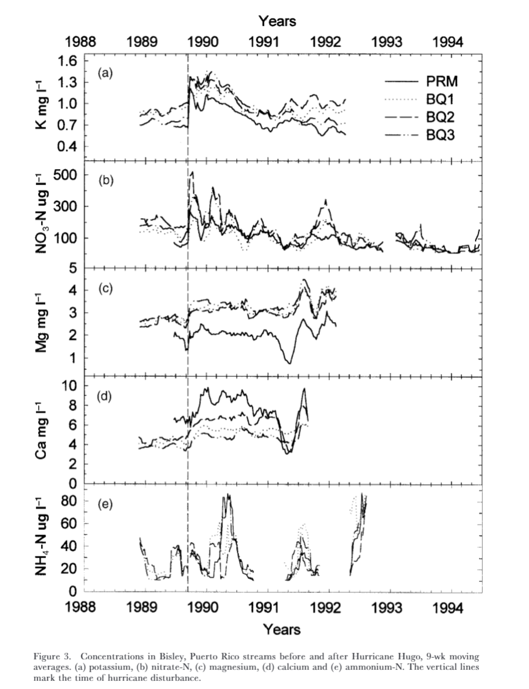

# Stream Nutrient Concentrations Before and After Hurricane Hugo

## Purpose:

This project produces a plot of five nutrient concentrations in streams in Bisley, Puerto Rico before and after Hurricane Hugo, reproducing the analysis by Schaefer et al. (2000).  

## Contents:

The repository includes all files necessary for reproducing the figure, including long-term data for the four stream sites analyzed, code for cleaning data, and an html document showing the final reproduced figures.

### Main Folders

| Folder        | Contents                       |
| ------------- | ------------------------------ |
| data          | Individual CSV files for each stream analyzed. |
| docs         | Files for hosting the paper webpage |
| images       | Image files of figures             |
|output        | csv file of cleaned data with 9 week moving averages |
| paper        | Files for the paper webpage |
| R            | Defined functions           |
| scratch      | Unpolished R code           |
| assessments  | Feedback from self, peers, and the instructor | 

## Data Access:
The data package used in this analysis is available through the Environmental Data Initiative and can be found at the [McDowel and International Institute of Tropical Forestry (IJTF) 2024](https://doi.org/10.6073/PASTA/F31349BEBDC304F758718F4798D25458). 

Data specific for reproducing the figure include the Quebrada one-Bisly (Q1) Chemistry Data, Quebrada two-Bisley (Q2) Chemistry Data, Quebrada three-Bisley (Q3) Chemistry Data, and Puente Roto Mameyes (MPR) Chemistry Data.

## Authors:

 - Olivia Knapp
 - [Ashwin Chockkalingam](https://github.com/ashrcho/arc214final)
 - [Kelly Loo](https://github.com/kloo49/kyl214final)

## References
McDowell, William H., and USDA Forest Service. International Institute Of Tropical Forestry (IITF). 2024. “Chemistry of Stream Water from the Luquillo Mountains.” Environmental Data Initiative. [https://doi.org/10.6073/PASTA/F31349BEBDC304F758718F4798D25458](https://doi.org/10.6073/PASTA/F31349BEBDC304F758718F4798D25458).

Schaefer, Douglas. A., William H. McDowell, Fredrick N. Scatena, and Clyde E. Asbury. 2000. “Effects of Hurricane Disturbance on Stream Water Concentrations and Fluxes in Eight Tropical Forest Watersheds of the Luquillo Experimental Forest, Puerto Rico.” Journal of Tropical Ecology 16 (2): 189–207. [https://doi.org/10.1017/s0266467400001358](https://doi.org/10.1017/s0266467400001358).

